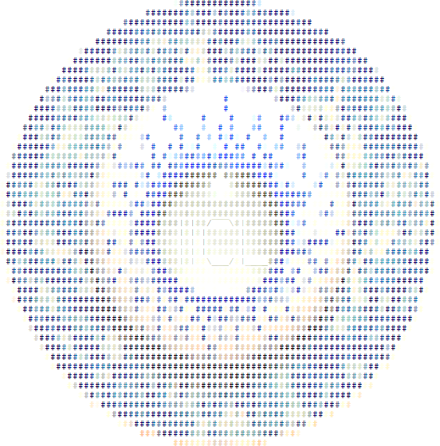

#

##Infinite Improbability Command Line

This is a command line application created in Python and exported out as a native application for Windows, Linux, and OSX.

It is designed to be a sample CLI that ships with UGUI.

* * *

###Commands

    -about
      The Infinite Improbability Command Line is a command line interface (CLI) that performs
      basic functions and is used as an example program for UGUI to create a GUI for.
      IICL is created in Python by Hai Nguyen.

    /?
    These are the common commands for IICL:
      -about               Gives information about IICL and credits
      -quote "file.txt"    Appends one Douglas Adams quote to the text file followed by two returns.
      -constellation [X]   Accepts orion, ursaminor, aries, and virgo
      -random X            Produces X number of random charachters max of 11
      -scramble "asdf"     Scrambles the text entered into a random order
      -quote               Echoes back one Douglas Adams Quote
      -help                Shows this message
      /?                   Shows this message

    -constellation aries
      The Aries constellation contains Teegarden's star.
    -constellation orion
      Some of the stars in the Orion constellation: Rigel, Betelgeuse, and Bellatrix.
    -constellation ursaminor
      Polaris is a star in the Ursa Minor constellation.
    -constellation virgo
      Spica is a star in the Virgo constellation.